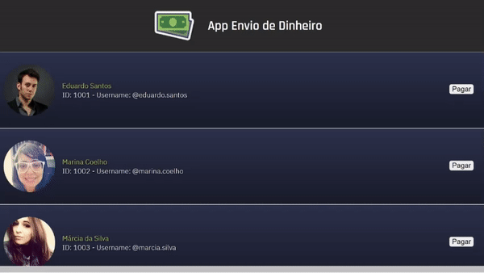
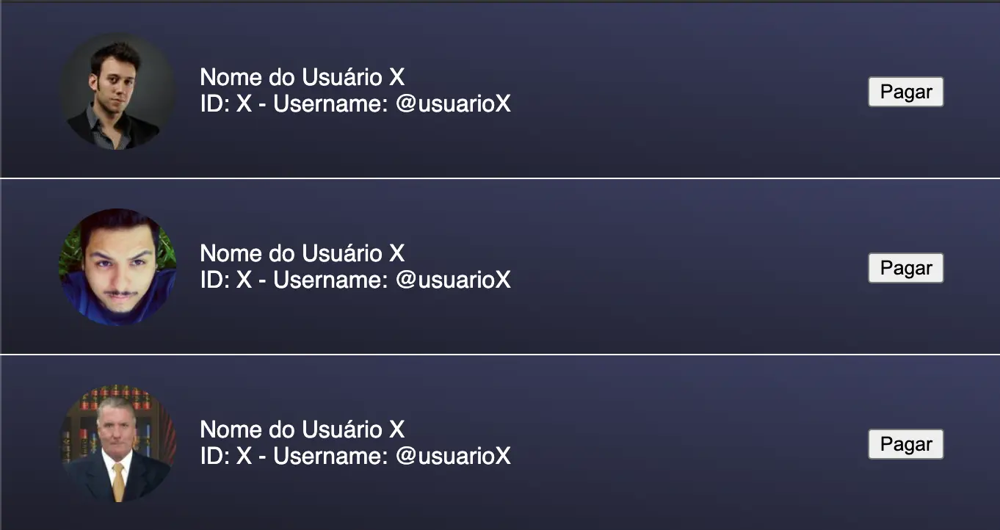
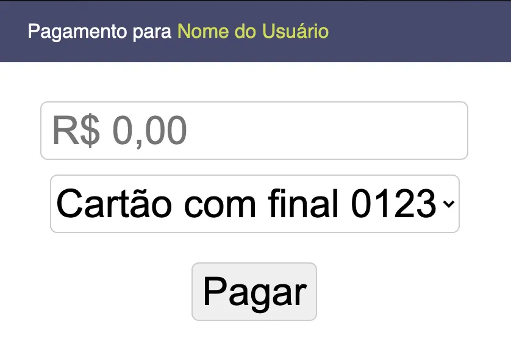
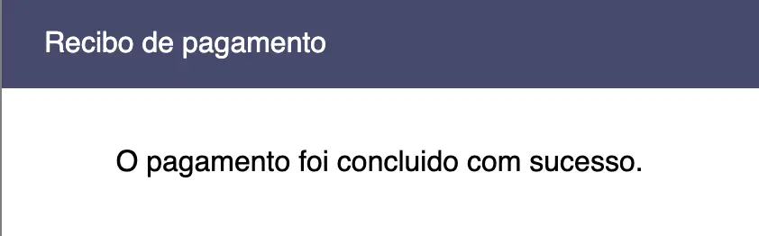
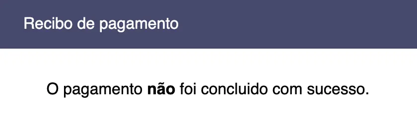

<h2>Projeto REACT (individual)</h2>

<h3>Descrição</h3>

O objetivo é construir uma aplicação que simula o envio de dinheiro para uma outra pessoa, via cartão de crédito.

<h3>Fluxo das telas</h3>

Na primeira tela terá uma listagem de usuários, onde a pessoa pode clicar em algum usuário da lista para realizar o pagamento. Quando clicado em um usuário é então aberto um modal de pagamento, contendo as informações do usuário de destino, a opção de selecionar um cartão de crédito e um botão de pagar. O usuário deve então digitar o valor, escolher o cartão e clicar em pagar. Para realização do pagamento deve-se chamar um endpoint de pagamento que aprovará/recusará a transação. E então deve-se mostrar na tela o modal de pagamento concluído com sucesso ou o de erro.

<strong>Link do Projeto:</strong> <a href="https://newtab-academy-react.netlify.app/" target="__blank">https://newtab-academy-react.netlify.app/</a>

  

<h3>Screenshots</h3>

<strong>Lista de usuários</strong>

<strong>Modal de pagamento e listagem de cartões</strong>

  

<strong>Modal de pagamento concluído com sucesso</strong>

  

<strong>Modal de erro no pagamento</strong>

  

<h3>Divisão de atividades</h3>

<ul>
  <li><strong>ATIVIDADE 1 – REACT:</strong></li>
  <ul>
    <li>Desenvolvimento da página de listagem de usuários</li>
  </ul>
</ul>

<ul>
  <li><strong>ATIVIDADE 2 – REACT:</strong></li>
  <ul>
    <li>Desenvolvimento das páginas de pagamentos e recibos</li>
  </ul>
</ul>

<h3>Prazo de entrega</h3>

Para as atividades, considerando uma dedicação de 4 horas por dia, estimamos que seja possível que você consiga realizá-las em aproximadamente uma semana cada. Se conseguir antes, fantástico! Já pode partir para a atividade seguinte e caminhar para o fechamento do módulo.

Aliás, o prazo para terminar esse módulo você já conhece, e após esse projeto individual vamos chegando ao final dessa etapa, onde você terá um conteúdo focado em empregabilidade para assistir enquanto aguarda nossa validação da entrega das atividades realizadas e agendamento da mentoria de feedback.

Caso precise de mais tempo que a estimativa de uma semana que citamos acima, sem problemas também, temos o prazo limite do módulo que precisa ser respeitado, e você pode ir administrando sua dedicação nesse período. Sempre que tiver dúvidas que não esteja conseguindo resolver por aí, lembre-se dos nossos recursos no Discord e facilitadores para te apoiar.

<h4><b>Status do Projeto:</b> :white_check_mark: Concluído</h4>